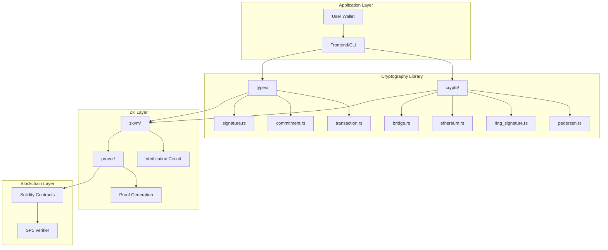
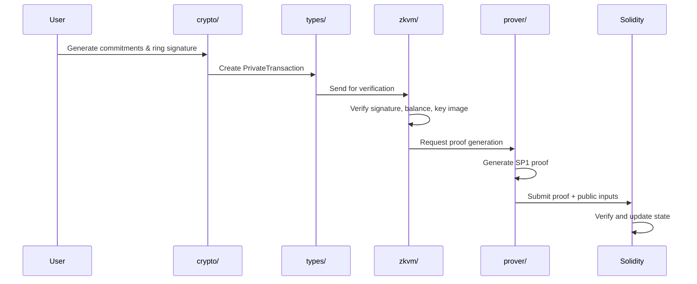

# Gelap Cryptography Architecture Documentation

## Overview

Gelap Cryptography is a Rust library providing cryptographic primitives for privacy-preserving transactions on Ethereum. The system leverages SP1 zkVM (Zero-Knowledge Virtual Machine) to perform heavy cryptographic computations off-chain while enabling verifiable correctness on-chain.

## System Architecture



## Workspace Structure

The project is organized as a Cargo workspace with four main crates:

| Crate | Purpose | Dependencies |
|-------|---------|--------------|
| `crypto` | Core cryptographic primitives | curve25519-dalek, secp256k1, sha2/sha3 |
| `types` | Shared data structures | serde |
| `zkvm` | SP1 guest program | sp1-zkvm, crypto, types |
| `prover` | SP1 host for proof generation | sp1-sdk, crypto, types |

## Core Components

### 1. Crypto Crate (`crypto/`)

The cryptographic primitives library providing all privacy features.

#### Module Overview

```
crypto/src/
├── lib.rs              # Public API exports
├── pedersen.rs         # Commitment scheme
├── ring_signature.rs   # LSAG ring signatures
├── ethereum.rs         # Stealth addresses (secp256k1)
├── bridge.rs           # Curve conversion utilities
├── zkproof.rs          # ZK primitive exports
├── utils.rs            # Hash functions & utilities
└── errors.rs           # Error types
```

#### Pedersen Commitments (`pedersen.rs`)

Implements Pedersen commitments on the Ristretto curve:

```
Commitment = amount * G + blinding * H
```

**Properties:**
- **Hiding**: Commitment reveals nothing about amount
- **Binding**: Cannot change amount after commitment
- **Homomorphic**: `C(a) + C(b) = C(a+b)`

**Key Functions:**
- `commit(amount, blinding)` → PedersenCommitment
- `verify_commitment(commitment, amount, blinding)` → bool
- `generate_blinding()` → Scalar

#### Ring Signatures (`ring_signature.rs`)

Implements LSAG (Linkable Spontaneous Anonymous Group) signatures:

```
Signature = (key_image, c[], r[])
```

**Properties:**
- **Anonymity**: Signer hidden in ring of public keys
- **Linkability**: Same key produces same key_image
- **Unforgeability**: Cannot forge without secret key

**Key Functions:**
- `sign_ring(message, secret_key, index, ring)` → RingSignature
- `verify_ring(signature, message, ring)` → bool

#### Ethereum Stealth Addresses (`ethereum.rs`)

Implements stealth addresses on secp256k1 for Ethereum compatibility:

```
Stealth Address = spend_pubkey + Hash(shared_secret) * G
```

**Properties:**
- **Unlinkability**: Each payment gets unique address
- **Scannability**: Recipient can detect payments
- **EVM Compatible**: Standard Ethereum addresses

**Key Functions:**
- `generate_stealth_eth(view_pubkey, spend_pubkey)` → StealthAddressEth
- `scan_stealth_eth(stealth_addr, view_secret, spend_pubkey)` → Option<SecretKey>

#### Curve Bridge (`bridge.rs`)

Converts between Ethereum's secp256k1 and ZK-friendly Ristretto curves:

**Key Functions:**
- `secp256k1_to_ristretto(pubkey)` → RistrettoPoint
- `address_to_ristretto(address)` → RistrettoPoint
- `hash_to_ristretto(data)` → RistrettoPoint

### 2. Types Crate (`types/`)

Shared data structures for transactions and proofs.

#### Module Overview

```
types/src/
├── lib.rs           # Module exports
├── transaction.rs   # PrivateTransaction struct
├── commitment.rs    # CommitmentData struct
├── signature.rs     # RingSignatureData struct
├── proof.rs         # ProofData & PublicInputs
├── stealth.rs       # StealthAddressData
└── wallet.rs        # Wallet-related types
```

#### PrivateTransaction

The main transaction structure containing all data for ZK verification:

```rust
pub struct PrivateTransaction {
    pub input_commitments: Vec<CommitmentData>,
    pub output_commitments: Vec<CommitmentData>,
    pub key_image: [u8; 32],
    pub ring: Vec<[u8; 32]>,
    pub stealth_addresses: Vec<StealthAddressData>,
    pub input_amounts: Vec<u64>,
    pub input_blindings: Vec<[u8; 32]>,
    pub output_amounts: Vec<u64>,
    pub output_blindings: Vec<[u8; 32]>,
    pub ring_signature: RingSignatureData,
    pub secret_index: usize,
}
```

#### PublicInputs

Public values committed by the zkVM for on-chain verification:

```rust
pub struct PublicInputs {
    pub input_commitments: Vec<[u8; 32]>,
    pub output_commitments: Vec<[u8; 32]>,
    pub key_image: [u8; 32],
    pub ring: Vec<[u8; 32]>,
}
```

### 3. zkVM Crate (`zkvm/`)

SP1 guest program that runs inside the zkVM.

#### Verification Logic

The zkVM program verifies:

1. **Ring Signature Verification**
   - Parse and validate ring members
   - Verify LSAG signature with challenge-response
   - Validate key image computation

2. **Commitment Balance**
   - Verify `sum(inputs) == sum(outputs)`
   - Validate each Pedersen commitment

3. **Key Image Validation**
   - Ensure secret index is valid
   - Prevent double-spending

4. **Output Public Inputs**
   - Commit verified data for on-chain use

```rust
// Simplified zkVM main logic
pub fn main() {
    let tx: PrivateTransaction = sp1_zkvm::io::read();
    
    // 1. Verify Ring Signature
    assert!(verify_ring_signature(&tx));
    
    // 2. Verify Commitment Balance
    assert_eq!(sum_inputs, sum_outputs);
    
    // 3. Verify Key Image
    assert!(valid_key_image);
    
    // 4. Commit Public Inputs
    sp1_zkvm::io::commit(&public_inputs);
}
```

### 4. Prover Crate (`prover/`)

SP1 host that generates proofs for Solidity verification.

#### Module Overview

```
prover/src/
├── lib.rs         # Core prover functions
├── network.rs     # Prover network integration
└── bin/
    ├── main.rs    # CLI for proof generation
    ├── evm.rs     # EVM-compatible proof generation
    └── vkey.rs    # Verification key extraction
```

#### Key Functions

```rust
// Generate proof for a transaction
pub fn generate_proof(tx: &PrivateTransaction) -> Result<ProofData>

// Verify generated proof
pub fn verify_proof(proof_data: &ProofData) -> Result<()>

// Get verification key for Solidity
pub fn get_verifying_key() -> Result<Vec<u8>>
```

#### Proof Systems

| System | Size | Verification Cost | Use Case |
|--------|------|-------------------|----------|
| Groth16 | ~200 KB | ~200K gas | Production |
| PLONK | ~500 KB | ~300K gas | Alternative |

## Transaction Flow

### Private Transaction Flow



### Proof Generation Flow

```
┌──────────────────┐
│  1. Create TX    │ → Use crypto/ to build transaction
└────────┬─────────┘
         │
         ▼
┌──────────────────┐
│  2. Serialize    │ → Use types/ to format for zkVM
└────────┬─────────┘
         │
         ▼
┌──────────────────┐
│  3. Verify       │ → zkVM runs verification circuit
└────────┬─────────┘
         │
         ▼
┌──────────────────┐
│  4. Prove        │ → prover/ generates SNARK proof
└────────┬─────────┘
         │
         ▼
┌──────────────────┐
│  5. Submit       │ → Proof sent to Solidity contract
└──────────────────┘
```

## Cryptographic Curves

### Ristretto255

Used for ring signatures and Pedersen commitments:
- **Prime Order Group**: No cofactor issues
- **ZK-Friendly**: Efficient in zkVM
- **Based on**: Curve25519

### secp256k1

Used for Ethereum compatibility:
- **EVM Standard**: Native Ethereum curve
- **Stealth Addresses**: Compatible with existing wallets
- **Bridged**: Converted to Ristretto for ZK operations

## Security Model

### Cryptographic Guarantees

| Feature | Guarantee | Mechanism |
|---------|-----------|-----------|
| Hidden Amounts | Computational Hiding | Pedersen Commitments |
| Hidden Sender | Ring Anonymity | LSAG Signatures |
| Hidden Receiver | Stealth Unlinkability | ECDH Key Exchange |
| No Double-Spend | Key Image Linkability | Deterministic Images |
| Valid State | Proof Soundness | SP1 zkVM |

### Trust Assumptions

- **SP1 zkVM**: Assumes soundness of proof system
- **Curve Security**: Assumes hardness of ECDLP
- **Hash Functions**: Assumes collision resistance

## Performance Characteristics

### Cryptographic Operations

| Operation | Time | Size |
|-----------|------|------|
| Pedersen Commit | ~50 μs | 32 bytes |
| Ring Sign (n=8) | ~2 ms | 32 + 64n bytes |
| Stealth Generate | ~100 μs | 52 bytes |
| Curve Bridge | ~10 μs | 32 bytes |

### Proof Generation

| Mode | Time | Proof Size |
|------|------|------------|
| Local (Groth16) | ~30-60s | ~200 KB |
| Network (Groth16) | ~10-20s | ~200 KB |
| Local (PLONK) | ~45-90s | ~500 KB |

## Dependencies

### Core Cryptography
- `curve25519-dalek` v4.1 - Ristretto operations
- `secp256k1` v0.28 - Ethereum curve
- `k256` v0.13 - ECDH/ECDSA

### Hashing
- `sha2` v0.10 - SHA-256/512
- `sha3` v0.10 - Keccak-256
- `tiny-keccak` v2.0 - Ethereum hashing

### SP1 Integration
- `sp1-zkvm` v5.2.3 - Guest program
- `sp1-sdk` v5.2.3 - Host SDK
- `sp1-build` v5.2.3 - Build utilities

### Serialization
- `serde` v1.0 - Serialization framework
- `bincode` v1.3 - Binary encoding
