# Gelap Cryptography System Design

## Table of Contents

1. [High-Level Overview](#high-level-overview)
2. [System Architecture](#system-architecture)
3. [Component Design](#component-design)
4. [Data Flow](#data-flow)
5. [Cryptographic Design](#cryptographic-design)
6. [zkVM Circuit Design](#zkvm-circuit-design)
7. [Proof System Design](#proof-system-design)
8. [Privacy Design](#privacy-design)
9. [Performance Design](#performance-design)
10. [Security Architecture](#security-architecture)

---

## High-Level Overview

### System Purpose

Gelap Cryptography is a **Rust cryptographic library** providing privacy primitives for anonymous transactions on Ethereum. It enables confidential token transfers by hiding amounts, senders, and receivers using zero-knowledge proofs.

### Key Design Goals

1. **Privacy**: Hide all transaction details from observers
2. **Security**: Cryptographically sound implementations
3. **Verifiability**: Proofs verifiable on-chain
4. **Modularity**: Composable cryptographic components
5. **Performance**: Optimized for zkVM execution
6. **Compatibility**: Bridge between Ethereum and ZK-friendly curves

### System Boundaries

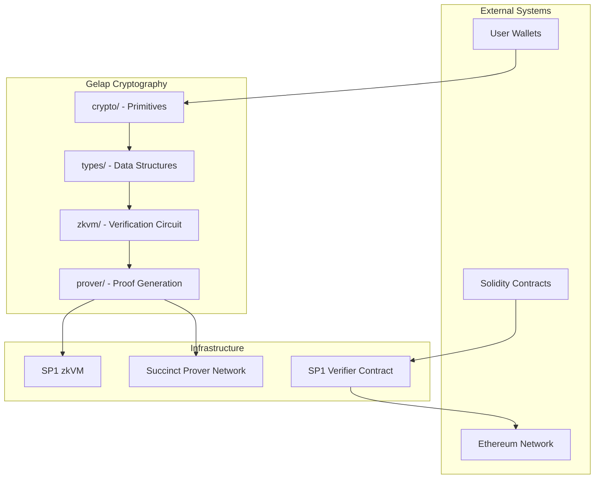

---

## System Architecture

### Workspace Structure

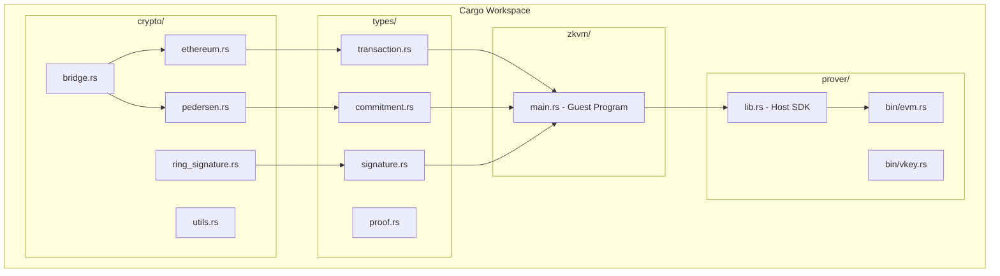

### Dependency Graph

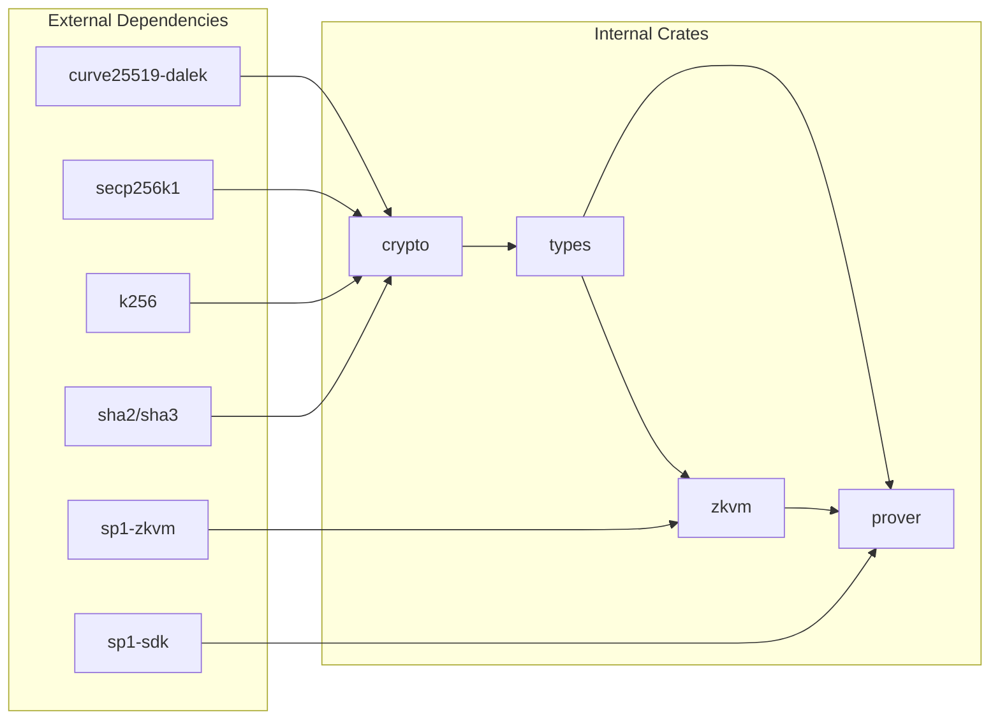

### Layered Architecture

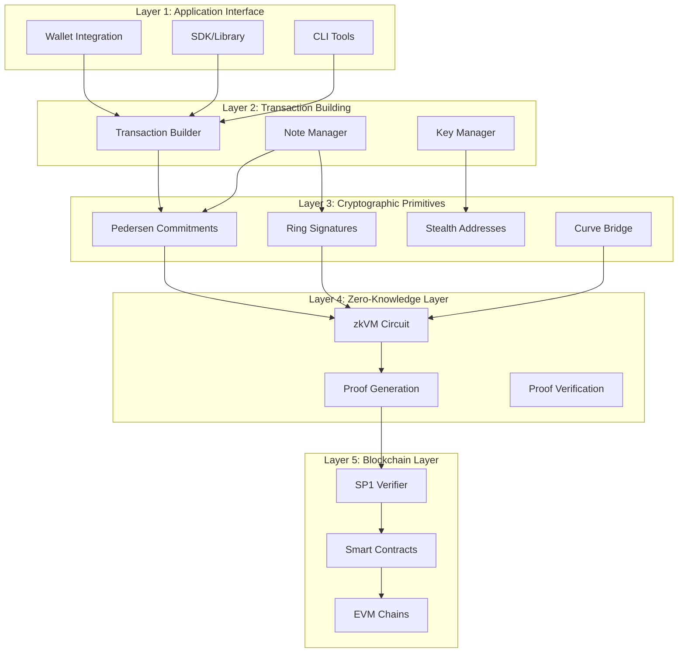

---

## Component Design

### 1. Crypto Crate

#### Pedersen Commitment Module

**Purpose**: Hide transaction amounts using homomorphic commitments.

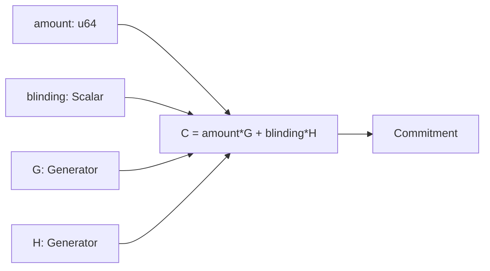

**Design Decisions:**
- **Curve**: Ristretto255 for prime-order group
- **Generators**: Deterministic H derived from G
- **Blinding**: 256-bit random scalar
- **Serialization**: Compressed point (32 bytes)

#### Ring Signature Module

**Purpose**: Hide sender identity within an anonymity set.

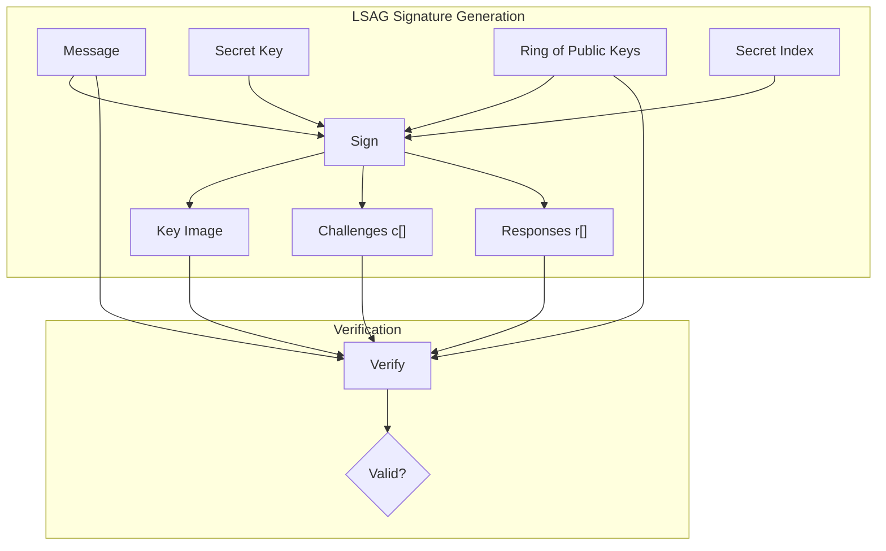

**Design Decisions:**
- **Scheme**: LSAG (Linkable Spontaneous Anonymous Group)
- **Key Image**: `I = x * Hp(P)` for linkability
- **Challenge**: Hash-based Fiat-Shamir transform
- **Ring Size**: Variable (recommended ≥8)

#### Ethereum Stealth Module

**Purpose**: Hide receiver identity using one-time addresses.

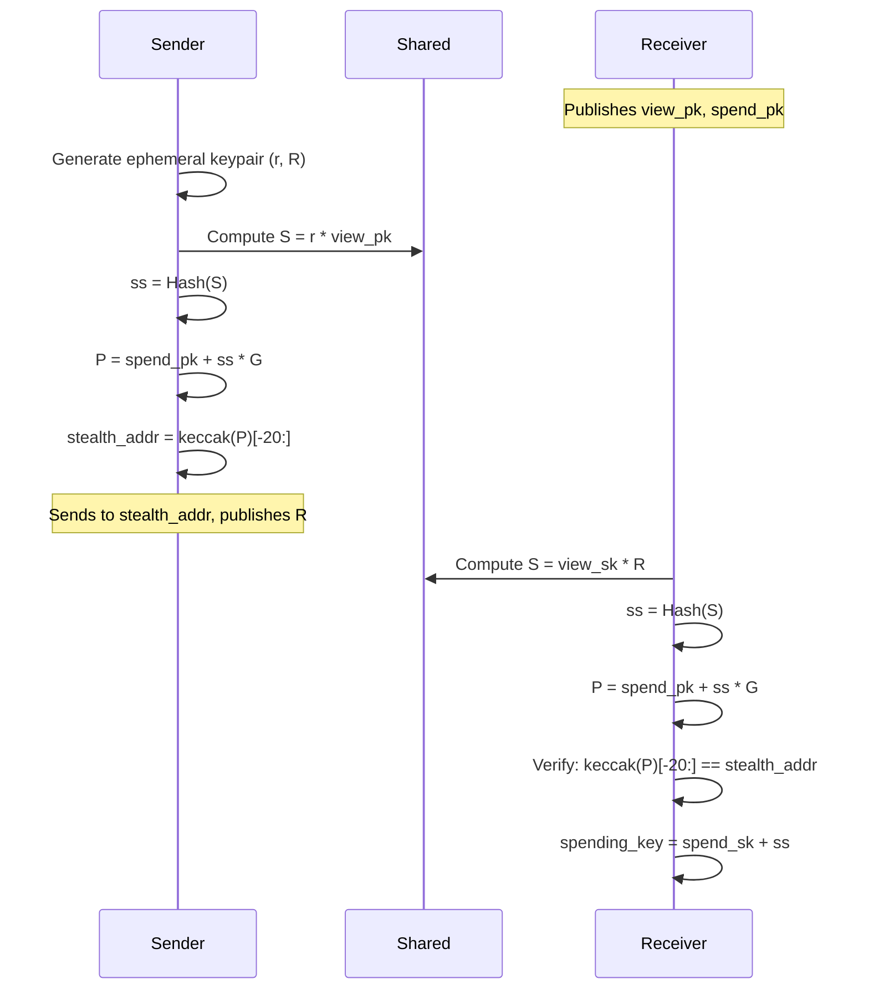

**Design Decisions:**
- **Curve**: secp256k1 for Ethereum compatibility
- **Key Derivation**: ECDH with view key
- **Address**: Standard 20-byte Ethereum format
- **Scanning**: O(n) in transactions

#### Bridge Module

**Purpose**: Convert between curves for ZK operations.

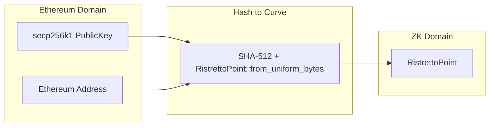

**Design Decisions:**
- **Method**: Hash-to-curve (not algebraic)
- **Hash**: SHA-512 for 512-bit output
- **Domain Separation**: Unique prefixes per operation
- **Deterministic**: Same input → same output

### 2. Types Crate

#### Transaction Structure

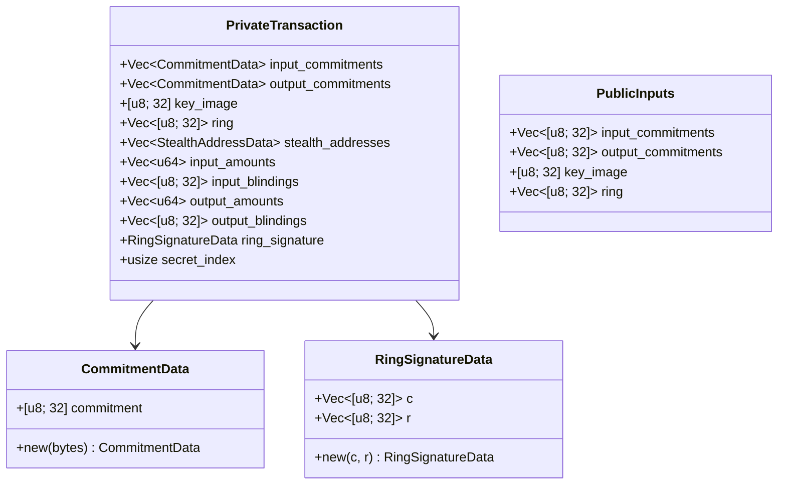

**Design Decisions:**
- **Serialization**: Serde + Bincode for zkVM
- **Fixed Sizes**: Arrays where possible for efficiency
- **Separation**: Public vs private data clearly separated

### 3. zkVM Crate

#### Circuit Design

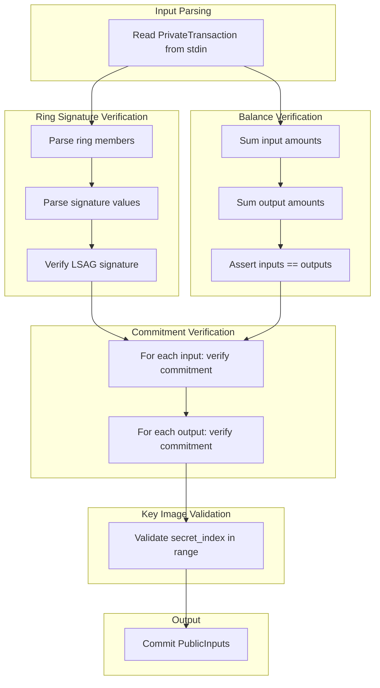

### 4. Prover Crate

#### Proof Generation Pipeline

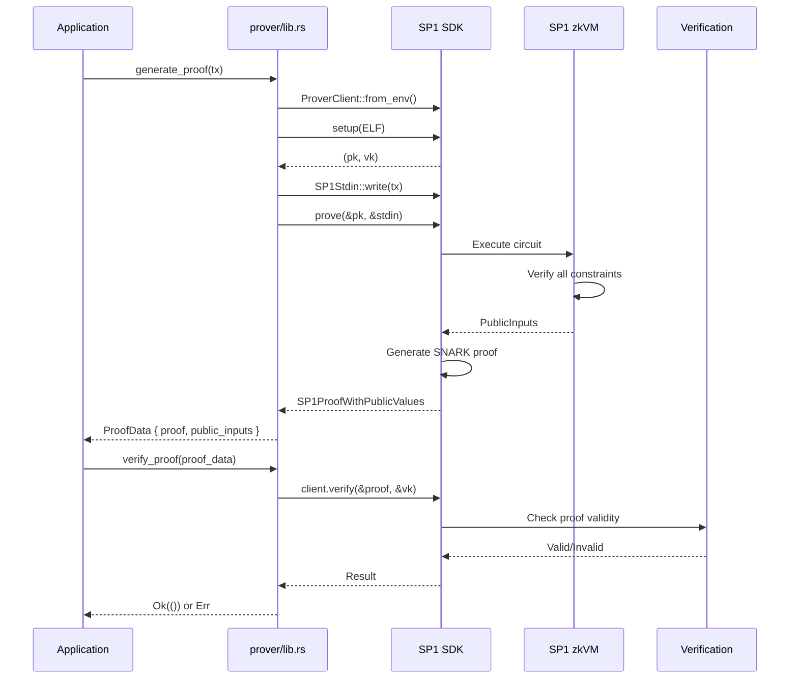

---

## Data Flow

### Private Transaction Creation

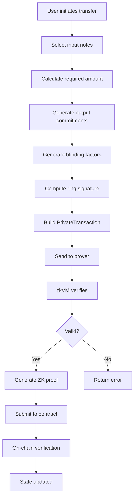

### Data Transformation Pipeline

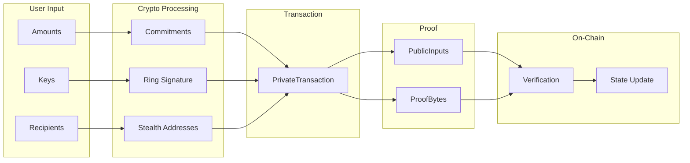

---

## Cryptographic Design

### Curve Selection

| Curve | Use Case | Properties |
|-------|----------|------------|
| Ristretto255 | Commitments, Ring Sigs | Prime order, twist-secure |
| secp256k1 | Stealth Addresses | Ethereum native |

### Hash Function Usage

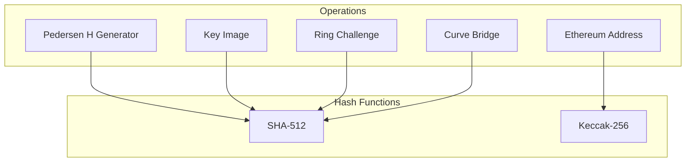

### Domain Separation

| Operation | Domain Prefix |
|-----------|---------------|
| H Generator | `Pedersen_H_GENERATOR_V2` |
| Key Image Hash | `HASH_TO_POINTS_V1` |
| Ring Challenge | `RING_SIG_V1` |
| Stealth ECDH | Native secp256k1 ECDH |

### Generator Points

```rust
// G: Standard Ristretto basepoint
let G = RISTRETTO_BASEPOINT_POINT;

// H: Derived from G (nothing-up-my-sleeve)
let H = SHA512("Pedersen_H_GENERATOR_V2" || G.compress())
    .map_to_ristretto();

// No known discrete log relationship: H = ?*G
```

---

## zkVM Circuit Design

### Constraint System

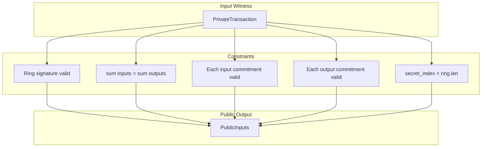

### Verification Steps

1. **Ring Signature Verification**
   - Parse compressed points
   - Compute challenge chain
   - Verify response values

2. **Balance Conservation**
   - Sum all input amounts
   - Sum all output amounts
   - Assert equality

3. **Commitment Verification**
   - Recompute each Pedersen commitment
   - Compare with claimed commitment

4. **Key Image Validation**
   - Verify index within bounds
   - (Future: verify key image computation)

### Circuit Complexity

| Operation | Approximate Constraints |
|-----------|------------------------|
| Point decompression | ~1000 |
| Scalar multiplication | ~2000 |
| SHA-512 hash | ~50000 |
| Per ring member | ~5000 |
| Per commitment | ~3000 |

---

## Proof System Design

### Proof Types

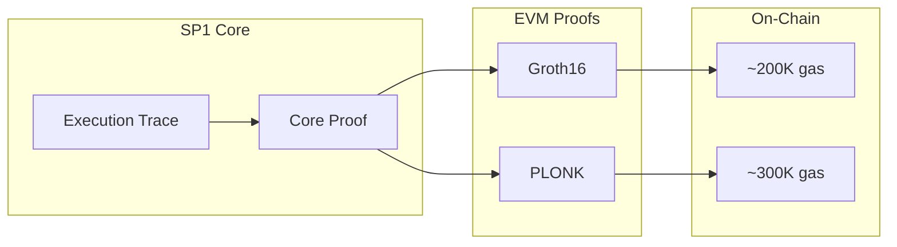

### Proof Generation Modes


---

## Privacy Design

### Privacy Properties

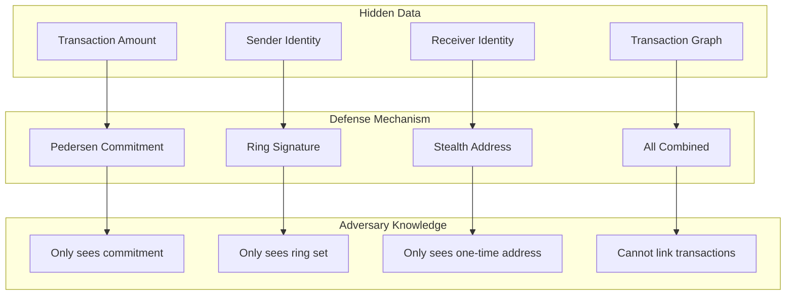

### Privacy Leakage Points

| Leak Point | Mitigation |
|------------|------------|
| Timing correlation | Add random delays |
| Amount correlation | Use common denominations |
| Ring reuse | Rotate decoy sets |
| Network metadata | Use Tor/VPN |
| Key image linkability | Inherent (for security) |

### Anonymity Set Size

```
Effective Anonymity = Ring Size × Stealth Factor

Where:
- Ring Size: Number of possible senders
- Stealth Factor: 1 (each address is unique)

Example: Ring of 8 = 1/8 probability of identification
```

---

## Performance Design

### Benchmarks

| Operation | Time | Memory |
|-----------|------|--------|
| Commitment creation | ~50 μs | <1 KB |
| Ring sign (n=8) | ~2 ms | ~10 KB |
| Ring verify (n=8) | ~2 ms | ~10 KB |
| Stealth generate | ~100 μs | ~1 KB |
| Full proof (local) | ~60 s | ~16 GB |
| Full proof (network) | ~15 s | Remote |

### Optimization Strategies

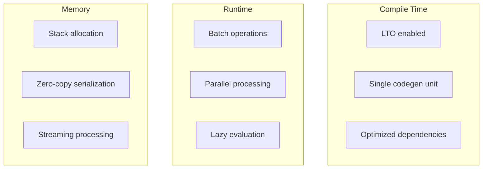

### Resource Requirements

| Component | Min RAM | Recommended RAM |
|-----------|---------|-----------------|
| Library usage | 256 MB | 1 GB |
| Local proving (Core) | 8 GB | 16 GB |
| Local proving (Groth16) | 16 GB | 32 GB |
| Network proving | 1 GB | 4 GB (client) |

---

## Security Architecture

### Threat Model

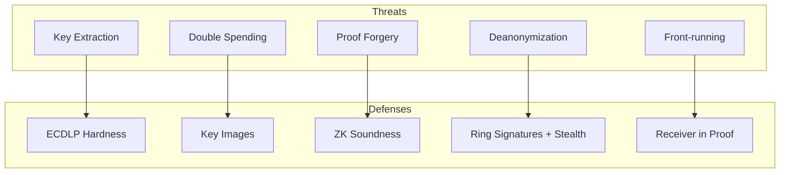

### Security Assumptions

1. **Discrete Log Hardness**: Cannot solve DL on Ristretto or secp256k1
2. **Hash Collision Resistance**: SHA-512 and Keccak-256 are secure
3. **Random Oracle Model**: Hash functions behave randomly
4. **SP1 Soundness**: zkVM proofs are computationally sound

### Attack Surface

| Surface | Risk | Mitigation |
|---------|------|------------|
| RNG | High | Use OsRng exclusively |
| Serialization | Medium | Validate all inputs |
| Side channels | Medium | Constant-time ops |
| Dependencies | Low | Audit, pin versions |

### Cryptographic Audit Scope

- [ ] Pedersen commitment implementation
- [ ] Ring signature implementation
- [ ] Key image derivation
- [ ] Stealth address ECDH
- [ ] Hash-to-curve implementation
- [ ] Scalar/point serialization
- [ ] zkVM circuit constraints

---

## Appendix

### A. Data Sizes

| Type | Size (bytes) |
|------|--------------|
| Scalar | 32 |
| RistrettoPoint (compressed) | 32 |
| Commitment | 32 |
| Key Image | 32 |
| Ring Signature (n members) | 32 + 64n |
| Ethereum Address | 20 |
| secp256k1 Public Key | 33 |
| PrivateTransaction (typical) | ~500-2000 |
| PublicInputs | ~200-500 |
| Groth16 Proof | ~200,000 |

### B. Configuration Constants

```rust
// Tree depth (from contracts)
const MERKLE_TREE_DEPTH: usize = 32;

// Minimum ring size
const MIN_RING_SIZE: usize = 2;

// Recommended ring size
const RECOMMENDED_RING_SIZE: usize = 8;

// Hash domain separators
const PEDERSEN_H_DOMAIN: &[u8] = b"Pedersen_H_GENERATOR_V2";
const RING_SIG_DOMAIN: &[u8] = b"RING_SIG_V1";
const HASH_TO_POINT_DOMAIN: &[u8] = b"HASH_TO_POINTS_V1";
```

### C. Error Codes

| Code | Description |
|------|-------------|
| `InvalidPoint` | Curve point decompression failed |
| `InvalidScalar` | Scalar out of range |
| `InvalidSignature` | Ring signature verification failed |
| `BalanceMismatch` | Input/output amounts don't match |
| `InvalidIndex` | Secret index out of bounds |
| `ProofGenerationFailed` | SP1 proof generation error |
| `ProofVerificationFailed` | SP1 proof verification error |
